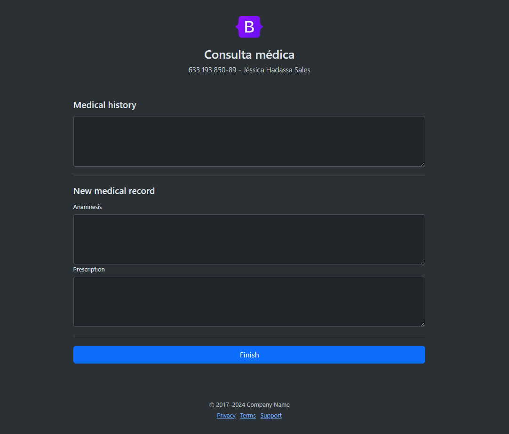

# 2TDSPS - 2024	Java Advanced

## Week 1 

* Apresentação da disciplina.
* Introdução ao Spring MVC.

### Excalidraw
[Live link](https://excalidraw.com/#room=02d1ce26a474992a7adc,9jG4fZGPh7wHA75FtiKiLA)

[Static Json file](readme-files/excalidraw/week1.excalidraw)

### Leituras complementares
* [OiArquitetura MVC e princípios de projeto (Célio Normando, 2024)](https://medium.com/@celionormando/arquitetura-mvc-e-princ%C3%ADpios-de-projeto-3d0b278ef910)
* [Introdução ao Padrão MVC (Higor, 2013)](https://www.devmedia.com.br/introducao-ao-padrao-mvc/29308)
* [Spring Web MVC](https://docs.spring.io/spring-framework/reference/web/webmvc.html)

## Week 2

* Desenho e definição do projeto.
* Spring MVC - Controllers.

### Desafio

Implementar a tela 4. Ilustração abaixo:



### Excalidraw
[Live link](https://excalidraw.com/#room=8c790a47dcdf6ee3b2a2,EUPJUq0iFe9_EA3jl06qAg)

[Static Json file](readme-files/excalidraw/week2.excalidraw)

### Leituras complementares
* [GitFlow](https://www.atlassian.com/git/tutorials/comparing-workflows/gitflow-workflow)
* [Conventional de commits](https://www.conventionalcommits.org/en/v1.0.0/#summary)
* [Bootsrap examples](https://getbootstrap.com/docs/5.3/examples/)


## Week 3

* Views and Thymeleaf.

### Relembrar

* Adicionar `xmlns:th="http://www.thymeleaf.org"` na tag html.
    Exemplo: 
    ```html
  <!doctype html>  
  <html xmlns:th="http://www.thymeleaf.org">
    ```
* Retornar um texto da controller ` th:text="${variavelNaController}"`
* Formularios devem conter:
  * Tag de abertura do form:
      * `action="#"`
      * `th:action="@{pathController}"`
      * `th:object="${objectName}"`
      * `method="post">`
  * Tag input field:
      *  `name="attributeName"`
      * `th:value="*{cpf}"`

### Leituras complementares
* [Como utilizar o DevTools no IntelliJ (Gustavo Monteiro, 2021)](https://omonteirox.medium.com/como-utilizar-o-devtools-no-intellij-f50344b5ec93)